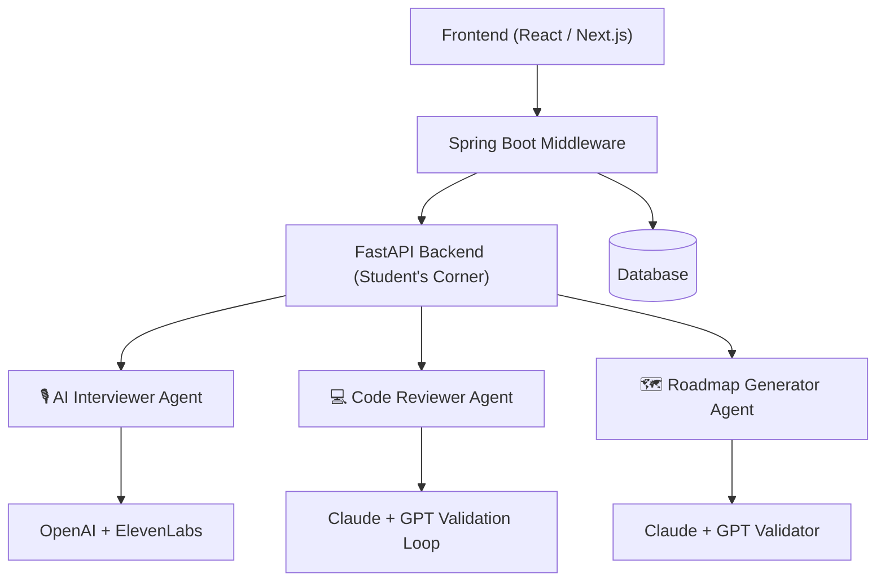

# 🎓 Student’s Corner — AI-Powered Career & Learning Platform

Student’s Corner is a **multi-agent AI platform** designed as a **one-stop solution for student needs** — from placement preparation to academic support.

It combines intelligent agents to help students:

* Prepare for technical interviews
* Improve code quality
* Generate personalized learning roadmaps
* *(Future)* Get help with exams, concepts, and subject-specific learning

---

## 🚀 Features

### 🎙️ AI Interview System

* Adaptive technical interviews (voice + text)
* Real-time answer evaluation with scoring
* Personalized feedback based on resume
* Voice delivery analysis (confidence, tone, pace)

---

### 💻 AI Code Reviewer

* Deep code analysis (bugs, complexity, optimization)
* Multi-agent validation (Claude + GPT)
* Iterative optimization for production-ready code
* Chat-based refinement (e.g., convert language, improve structure)

---

### 🗺️ Adaptive Roadmap Generator

* Personalized learning paths based on goals
* Dynamic updates via chat interface
* Visual graph structure (nodes + edges)
* Skill gap analysis

---

### 🔗 Unified Platform Architecture

* Single backend handling multiple AI agents
* Centralized session management
* Middleware integration for persistence

---

## 🧠 System Architecture

```
Frontend (React / Next.js)
        │
        ▼
Spring Boot Middleware
(Auth, DB, Resume Parsing)
        │
        ▼
FastAPI Backend (Student’s Corner)
        │
        ├── 🎙️ AI Interviewer Agent
        ├── 💻 Code Reviewer Agent
        └── 🗺️ Roadmap Generator Agent
        │
        ├── OpenAI (GPT models)
        ├── Anthropic (Claude models)
        └── ElevenLabs (Voice AI)
```

---

## 📊 System Design Diagram



### 🔍 Flow Explanation

1. User interacts with the frontend
2. Requests go through **Spring Boot Middleware** (auth + persistence)
3. Middleware forwards requests to **FastAPI backend**
4. Backend routes to the appropriate AI agent
5. Agents interact with AI providers (OpenAI, Anthropic, ElevenLabs)
6. Final results are sent back and stored via middleware

---

## 🧩 Agents Overview

### 🎙️ AI Interviewer Agent

* Conducts adaptive interviews based on resume
* Generates questions dynamically
* Evaluates answers with scoring & feedback
* Provides final performance summary

---

### 💻 Code Reviewer Agent

* Understands code structure and logic
* Detects bugs and inefficiencies
* Suggests optimizations and best practices
* Uses **Claude ↔ GPT validation loop** for accuracy

---

### 🗺️ Roadmap Generator Agent

* Generates structured learning plans
* Converts roadmap into visual graph format
* Supports iterative updates via chat
* Tracks versions and learning progression

---

## ⚙️ Tech Stack

### Backend

* FastAPI (Python)
* Pydantic (data validation)

### AI Models

* OpenAI (GPT-4o-mini)
* Anthropic (Claude Sonnet / Opus)

### Voice AI

* ElevenLabs (TTS + Conversational Agent)

### Middleware

* Spring Boot (Java)
* Handles authentication, storage, and orchestration

### Frontend (Expected)

* React / Next.js
* React Flow (graph visualization)

---

## 📂 Project Structure

```
project_root/
├── main.py                    # FastAPI entry point
├── ai_interviewer/            # Interview Agent
├── code_reviewer/             # Code Review Agent
├── roadmap_generator/         # Roadmap Agent
├── requirements.txt
├── .env
```

---

## 🔌 API Overview (High-Level)

### Interview

* `POST /interview/start`
* `POST /interview/answer/text`
* `POST /interview/answer/voice`

### Code Review

* `POST /review/start`
* `POST /review/{id}/optimize`
* `POST /review/{id}/chat`

### Roadmap

* `POST /roadmap/generate`
* `POST /roadmap/chat/{id}`
* `POST /roadmap/terminate/{id}`

---

## 🎬 Demo Flow

### 🎙️ AI Interview Flow

```
1. User uploads resume
2. Middleware extracts resume text
3. POST /interview/start
4. AI asks first question
5. User answers (voice/text)
6. AI evaluates + gives feedback
7. Loop continues until completion
8. Final summary generated
```

---

### 💻 Code Review Flow

```
1. User submits code
2. POST /review/start
3. Code Understanding (Claude)
4. Technical Review (Claude)
5. Quality Review (GPT)
6. User can:
   → Optimize code
   → Chat for refinements
7. Final optimized code returned
```

---

### 🗺️ Roadmap Generation Flow

```
1. User enters goal (e.g., "Machine Learning")
2. POST /roadmap/generate
3. AI generates roadmap + graph
4. UI renders graph (React Flow)
5. User modifies via chat:
   → "Make it more advanced"
   → "Remove SQL"
6. AI updates roadmap dynamically
7. Final roadmap saved
```

---

## 🛠️ Setup Instructions

### 1. Clone the repository

```bash
git clone <your-repo-url>
cd students-corner
```

### 2. Install dependencies

```bash
pip install -r requirements.txt
```

### 3. Configure environment

Create `.env` file:

```
OPENAI_API_KEY=your_key
ANTHROPIC_API_KEY=your_key
ELEVENLABS_API_KEY=your_key
ELEVENLABS_AGENT_ID=your_id
MIDDLEWARE_URL=http://localhost:8080
```

### 4. Run the server

```bash
uvicorn main:app --reload --port 8000
```

### 5. Open API Docs

```
http://127.0.0.1:8000/docs
```

---

## 🔮 Future Scope

* 📚 Exam preparation assistant
* 🧠 Topic-wise concept explanations
* 📄 Resume reviewer + ATS scoring
* 📊 Performance analytics dashboard
* 📁 Multi-file code analysis
* 🧪 Test case generation from code
* 🔐 Persistent session storage (Redis/PostgreSQL)

---

## 🎯 Vision

To build a **complete AI-powered student ecosystem** that supports:

* Learning
* Practice
* Evaluation
* Career preparation

— all in one unified platform.

---

## 👨‍💻 Author

**Sayak Mitra Majumder**
Computer Science Student

---

## 📄 License

MIT
